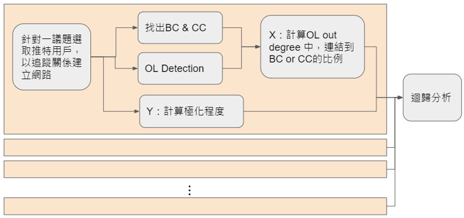

 
## Social_Media_Analysis: 議題兩極化程度與意見領袖對群體橋梁連結之關聯性 ##

To test if the amount of connections between "high centrality twitter users" and other users, is relative to the polarity of a social issue in the society.

### Data ###
Social issue we picked for further analyzing:
- 疫苗（Vaccine）
- 多元性別平權（LGBTQIA+ equality）
- 死刑（Death penalty）
- 合法墮胎（Legal abortion）
- 槍枝管制（Gun control）
- 富人稅（Wealth tax）
- 大麻合法化（Drug legalization）
- 移民（Immigrant）

Based on the issues above, we search for American senators' tweets as start up points, and crawl the users data who retweeted the post, to build the users connection network of an issue. 

### Research flow ###

### Reference ###
* Wesley Cota, Silvio C. Ferreira, Romualdo Paster-Satorras, and Michele Starnini (2019) Quantifying echo chamber effects in information spreading over political communication networks. 
* Ad Fontes Media, the media bias chart 9.0
https://adfontesmedia.com
* David, K., & Robert N., S. (1988). Informal networks and organizational crises: An experimental simulation. Social Psychology Quarterly, 51(2). 
* Bruns, A. (2017). Echo Chamber? What Echo Chamber? Reviewing the Evidence. Biennial Future of Journalism Conference, 6. https://snurb.info/files/2017/Echo%20Chamber.pdf
* USC Annenberg School for Communication and Journalism, Zignal labs, & Golin. (2022, March). The Polarization Index Report. The Polarization Index. Retrieved June, 2022, from https://thepolarizationindex.com/
